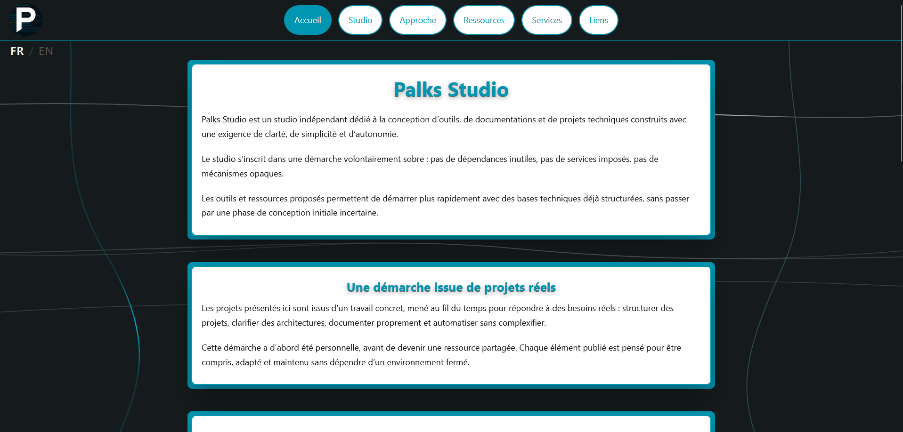

<p align="center">
  
</p>

> 🇫🇷 Français | [🇬🇧 English](./README.md)


<p align="center">
  <a href="https://palks-studio.com">
    
  </a>
</p>

# Palks Studio — Fondation de Site Web Statique Professionnel

> Ce dépôt constitue une présentation technique et une documentation du projet.  
> Il ne contient pas de code source téléchargeable ni de fichiers de production.

Base complète de site web statique conçue pour servir de **fondation claire, autonome et durable**  
à des projets professionnels ou techniques.

Ce socle s’adresse à des **développeurs, intégrateurs ou équipes techniques**  
souhaitant garder un contrôle total sur leur code,  
sans dépendre de frameworks lourds, de CMS ou de services tiers.

---

## Objectif du projet

Ce projet fournit une **structure HTML / CSS propre et maintenable**  
permettant de démarrer rapidement un site sérieux, lisible et évolutif.

Il ne s’agit pas d’un thème graphique figé,  
mais d’une **base technique solide**, pensée pour être :  

- comprise rapidement  
- personnalisée facilement  
- étendue sans complexité inutile

---

## Contenu du socle

Le projet inclut :  

- Plusieurs pages HTML complètes et structurées  
- Une architecture claire et cohérente  
- Un CSS organisé, commenté et modulaire  
- Une hiérarchie de titres respectant les bonnes pratiques SEO  
- Des attributs ARIA et contenus accessibles  
- Un `robots.txt`  
- Un `sitemap.xml`  
- Des commentaires repères pour la personnalisation  
- Une licence d’utilisation claire

Aucune dépendance externe n’est imposée.

---

## Structure du site

```
/static_site_fr/
│
├── index.html                        → Page d’accueil principale (présentation du socle)
├── a-propos.html                     → À propos : philosophie et vision du projet
├── approche.html                     → Approche de conception et principes techniques
├── ressources.html                   → Ressources, références et bonnes pratiques
├── liens.html                        → Liens externes et ressources complémentaires
├── contact.html                      → Page de contact et informations de prise de contact
├── conditions-utilisation.html       → Conditions d’utilisation et cadre d’usage
├── mentions-legales.html             → Mentions légales obligatoires
├── politique-confidentialite.html    → Politique de confidentialité et données
│
├── assets/
│   ├── css/
│   │   └── style.css                 → Feuille de styles globale (modifiable ou intégrable)
│   └── img/                          → Images, icônes et visuels du site
│
├── site.webmanifest                  → Manifest PWA (optionnel, personnalisable)
│
├── robots.txt                        → Règles d’exploration pour les moteurs de recherche
├── sitemap.xml                       → Plan du site pour l’indexation SEO
│
├── README.md                         → Documentation d’utilisation et personnalisation
└── LICENCE.md                        → Conditions d’utilisation et cadre légal
```


---

## Pages incluses

Le socle contient notamment :  

- Accueil  
- À propos  
- Approche  
- Ressources  
- Liens  
- Contact  
- Conditions d’utilisation  
- Mentions légales  
- Politique de confidentialité

Chaque page dispose :  

- de ses balises SEO propres  
- d’une structure cohérente  
- d’un contenu générique prêt à être adapté

---

## Accessibilité

Une attention particulière a été portée à l’accessibilité :  

- Hiérarchie sémantique correcte  
- Titres structurés (`h1` → `h2` → `h3`)  
- Textes invisibles pour lecteurs d’écran (`visually-hidden`)  
- Attributs ARIA lorsque pertinent

Ce socle constitue une base saine pour des projets soucieux de l’accessibilité.

---

## SEO

Le socle est optimisé pour le référencement naturel :  

- Balises `title` et `meta description` par page  
- Open Graph et Twitter Cards  
- Canonical  
- Sitemap  
- Robots.txt

Les contenus sont volontairement génériques et doivent être personnalisés  
avant toute mise en production finale.

---

## Personnalisation rapide

Pour adapter le site à votre projet :  

- Remplacer le logo dans `assets/img/`  
- Modifier les textes dans les fichiers HTML  
- Ajuster les couleurs dans `:root`  
- Adapter ou étendre le CSS existant  
- Ajouter des scripts JavaScript si nécessaire (optionnel)  
- Les icônes, favicons et logos ne sont pas fournis et doivent être ajoutés par l’utilisateur.

Le CSS est intégré directement dans les pages par défaut.

Une option permet de charger les styles via un fichier externe  
(`/assets/css/style.css`) : la ligne <link> est présente mais  
commentée et peut être activée à tout moment.

---

## Ce que ce projet n’est pas

Ce socle **n’est pas** :  

- un CMS  
- un site clé en main grand public  
- un constructeur visuel  
- un framework JavaScript

Il s’adresse à des profils techniques  
ou à des équipes souhaitant un point de départ propre et maîtrisé.

---

## Philosophie

Ce socle privilégie :  

- la clarté plutôt que l’effet  
- la lisibilité plutôt que la sur-optimisation  
- la maîtrise du code plutôt que l’automatisation opaque

Il est pensé comme une **fondation**, pas comme une finalité.

---

## Support

Aucun support n’est inclus.

Ce projet s’adresse à des utilisateurs capables :  

- de lire du HTML / CSS  
- d’adapter le contenu à leurs besoins  
- de gérer leur propre déploiement

---

## Conclusion

Si vous cherchez une base fiable, propre et durable  
pour démarrer un site statique professionnel,  
ce socle a été conçu pour vous faire gagner du temps  
sans sacrifier la qualité ni la compréhension.

© Palks Studio — voir LICENSE.md  
- https://palks-studio.com
